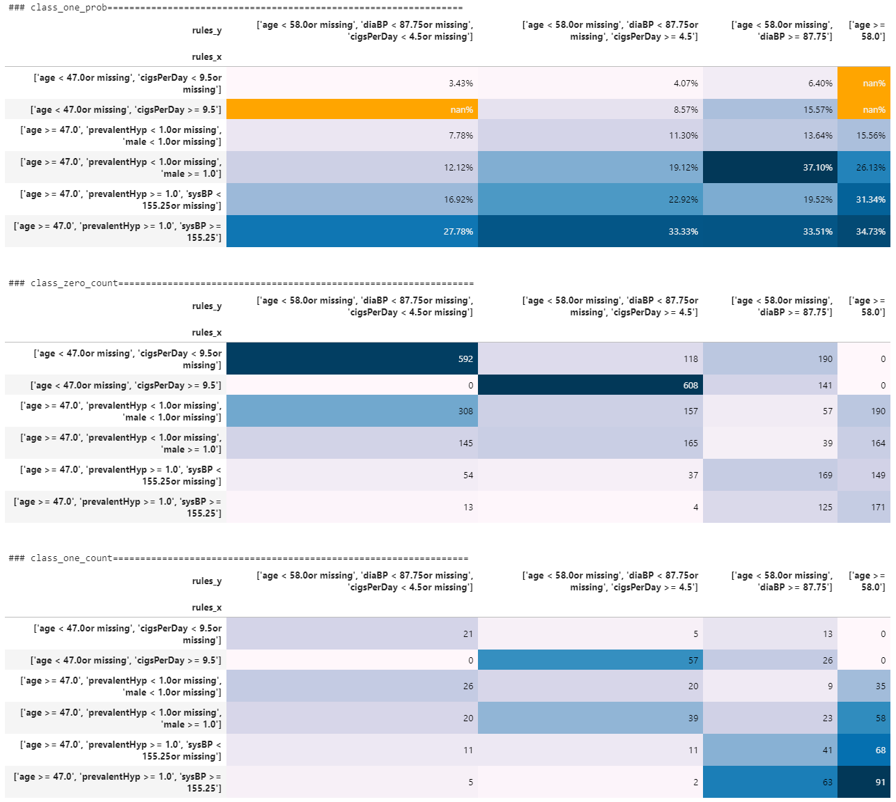

# Explanation

This library helps you understand the data that you are analysing better. It uses XGBoost to find some relations in the data in forms of if-else rules in order to cluster data into groups. Then, it visualises the percentage of positive class as well as the number of samples of positive and zero class in the form of 2D matrices. you may use "pip install xgboost" to install the required library. Hope this library can help you to get some idea from your data.

The example below showห the probability of getting some kind of cardiovascular disease in ten yearห. You can see the probability by clusters in the first matrix in the section "Use model to visualise data by group and class". Also, the other 2 matrices show a number of class 1 and class 0 for each cluster. 

!!!Note that this version of the library only supports the data with binary classes. If you provide data with multi classes, unexpected results may occur

# Read data (framingham dataset [from kaggle][https://www.kaggle.com/neisha/heart-disease-prediction-using-logistic-regression/data] for 10-Year Coronary Heart Disease Risk Prediction')


```python
import pandas as  pd
import os
dataset = pd.read_csv(os.path.join('data', 'framingham.csv')).dropna()
y_col  = 'TenYearCHD'
x, y = dataset.drop(columns = [y_col]), dataset[y_col]
num_sample = x.shape[0]
scale_pos_weight = ((y.value_counts().max()/y.value_counts())**0.75)[1]
```

# Train XGBoost2vis model


```python
from source.model import XGBoost2Vis
from source.train import train
import xgboost as xgb
from xgboost import plot_tree
model = XGBoost2Vis(scale_pos_weight = scale_pos_weight, 
                   min_child_weight = int(num_sample*0.05))
train(model, x, y)
```

# Use model to visualise data by group and class


```python
from source.predict import predict, model_fn
model = model_fn()
class_zero_count, class_one_count, class_one_prob = predict(model, x, y)
for name, matrix in {'class_one_prob': class_one_prob, 'class_zero_count': class_zero_count, 
                     'class_one_count': class_one_count}.items():
    print(f'### {name}=================================================================')
    display(matrix)
    print()
    print()
```

